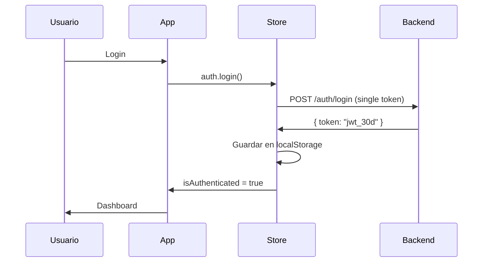
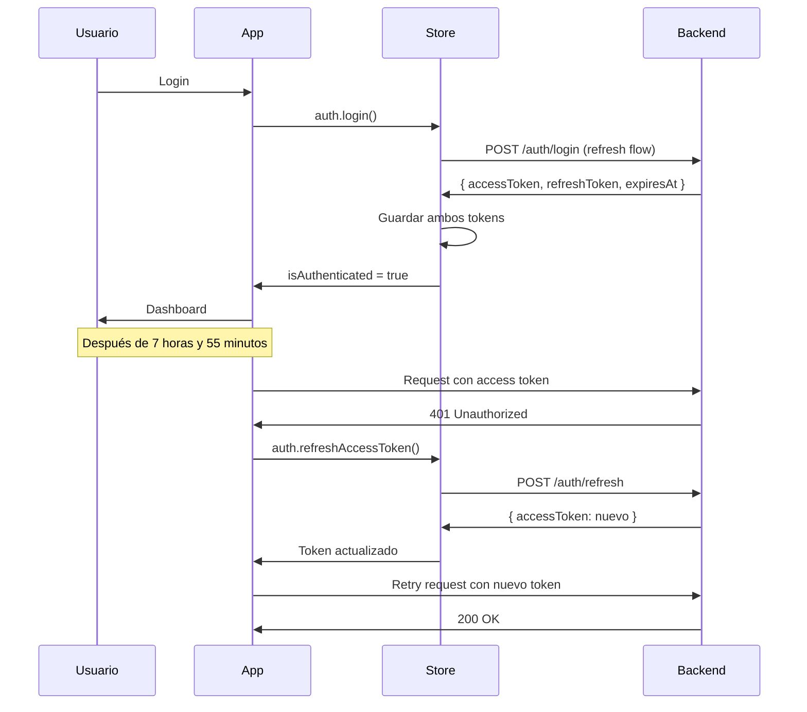

# PLANIFICACIÓN COMPLETA - MIGRACIÓN A REFRESH TOKENS
## Sistema de Autenticación RapiFirma v2.0

---

## 🎯 OBJETIVO

Migrar del sistema actual de JWT simple (access token de larga duración) a un sistema robusto con **Access Token de corta duración (8h) + Refresh Token de larga duración (7d)**, manteniendo compatibilidad y mejorando la seguridad y experiencia de usuario.

---

## 📊 ANÁLISIS DEL SISTEMA ACTUAL vs NUEVO

### SISTEMA ACTUAL (v1.0 - Single Token)
```javascript
// LOGIN RESPONSE ACTUAL
{
  "token": "eyJhbGciOiJIUzI1NiJ9..."  // Token único, larga duración
}

// ALMACENAMIENTO ACTUAL
localStorage: {
  "rf_auth": {
    "token": "jwt...",
    "usernameFallback": "usuario123"
  }
}
```

**CARACTERÍSTICAS ACTUALES:**
- ✅ Token único JWT
- ✅ Almacenamiento simple en localStorage
- ✅ Expiración manejada por claims del token
- ❌ Token de larga duración (riesgo de seguridad)
- ❌ No hay renovación automática
- ❌ Logout forzado cuando expira

### SISTEMA NUEVO (v2.0 - Refresh Token)
```javascript
// LOGIN RESPONSE NUEVO
{
  "accessToken": "eyJhbGciOiJIUzI1NiJ9...",    // 8 horas
  "refreshToken": "eyJhbGciOiJIUzI1NiJ9...",   // 7 días
  "expiresAt": "2024-12-03T23:00:00Z",        // Timestamp explícito
  "requiresPasswordChange": false
}

// ALMACENAMIENTO NUEVO
localStorage: {
  "rf_auth": {
    "accessToken": "jwt_access...",
    "refreshToken": "jwt_refresh...",
    "expiresAt": "2024-12-03T23:00:00Z",
    "usernameFallback": "usuario123",
    "requiresPasswordChange": false
  }
}
```

**CARACTERÍSTICAS NUEVAS:**
- ✅ Access token corto (8h) - menor superficie de ataque
- ✅ Refresh token largo (7d) - mejor UX
- ✅ Renovación automática y transparente
- ✅ Endpoint de refresh específico
- ✅ Logout que invalida ambos tokens
- ✅ Timestamp explícito para mayor precisión

---

## 🗺️ MAPA DE MIGRACIÓN - ETAPAS

### ETAPA 0: PREPARACIÓN Y ANÁLISIS (Foundation)
**Objetivo:** Establecer base sólida para migración segura

#### 0.1 Análisis de Impacto
- [ ] Identificar todos los puntos donde se usa el token actual
- [ ] Mapear componentes que dependen del token
- [ ] Analizar flujos críticos de usuario
- [ ] Identificar dependencias externas

#### 0.2 Configuración de Feature Flags
- [ ] Implementar sistema de feature flags para migración gradual
- [ ] Crear variables de entorno para新旧 sistema control
- [ ] Establecer monitoreo y logging para migración

#### 0.3 Testing Strategy
- [ ] Crear suite de tests para nuevo sistema
- [ ] Implementar tests de compatibilidad
- [ ] Configurar E2E tests para flujos completos

---

### ETAPA 1: INFRAESTRUCTURA CORE (Backend Integration) ✅ COMPLETADA
**Objetivo:** Construir base técnica para refresh tokens

#### 1.1 Extensión de AuthService ✅ IMPLEMENTADO
```javascript
// src/services/auth.service.js - NUEVA IMPLEMENTACIÓN
export const AuthService = {
  async login({ username, password }) {
    const { data } = await api.post("/api/auth/login", { username, password });
    return {
      accessToken: data.accessToken,
      refreshToken: data.refreshToken,
      expiresAt: data.expiresAt,
      requiresPasswordChange: data.requiresPasswordChange
    };
  },

  async refreshToken(refreshToken) {
    const { data } = await api.post("/api/auth/refresh", { refreshToken });
    return {
      accessToken: data.accessToken
      // Notar: NO devuelve nuevo refreshToken
    };
  },

  async logout(refreshToken) {
    const { data } = await api.post("/api/auth/logout", { refreshToken });
    return data;
  },

  async changePassword({ currentPassword, newPassword }) {
    const { data } = await api.post("/api/auth/change-password", {
      currentPassword,
      newPassword
    });
    return data;
  }
};
```

#### 1.2 Nuevo Store de Autenticación ✅ IMPLEMENTADO
```javascript
// src/stores/auth.js - VERSIÓN 2.0
export const useAuthStore = defineStore("auth", {
  state: () => ({
    accessToken: null,
    refreshToken: null,
    expiresAt: null,
    requiresPasswordChange: false,
    user: null,
    // Estado de refresh
    isRefreshing: false,
    refreshPromise: null, // Para evitar múltiples refresh concurrentes
    // Compatibilidad temporal con código antiguo
    token: null, // Se mantendrá sincronizado con accessToken
  }),

  getters: {
    isAuthenticated: (s) => !!s.accessToken && !!s.user,
    isAdmin: (s) => s.user?.role === "Admin",
    tokenExpiry: (s) => s.expiresAt ? new Date(s.expiresAt).getTime() : null,
    isTokenExpired: (s) => {
      if (!s.expiresAt) return true;
      return new Date() > new Date(s.expiresAt);
    },
    shouldRefresh: (s) => {
      if (!s.expiresAt) return false;
      const now = new Date();
      const expires = new Date(s.expiresAt);
      const diff = expires.getTime() - now.getTime();
      // Refresh 5 minutos antes de expirar
      return diff <= 5 * 60 * 1000;
    },
  },

  actions: {
    // LOGIN ACTUALIZADO
    async login({ username, password }) {
      const tokens = await AuthService.login({ username, password });

      this.accessToken = tokens.accessToken;
      this.refreshToken = tokens.refreshToken;
      this.expiresAt = tokens.expiresAt;
      this.requiresPasswordChange = tokens.requiresPasswordChange;
      this.token = tokens.accessToken; // Mantener compatibilidad

      const mapped = mapClaims(tokens.accessToken);
      if (!mapped.username) mapped.username = username;
      this.user = mapped;

      this.persist(username);
      return tokens;
    },

    // REFRESH AUTOMÁTICO ✅ IMPLEMENTADO
    async refreshAccessToken() {
      if (this.isRefreshing && this.refreshPromise) {
        return this.refreshPromise;
      }

      if (!this.refreshToken) {
        throw new Error("No refresh token available");
      }

      this.isRefreshing = true;
      this.refreshPromise = this.performRefresh();

      try {
        const { accessToken } = await this.refreshPromise;
        this.accessToken = accessToken;
        this.token = accessToken; // Mantener compatibilidad

        // Actualizar expiresAt del nuevo access token
        const decoded = jwtDecode(accessToken);
        this.expiresAt = new Date(decoded.exp * 1000).toISOString();

        this.persist();
        return accessToken;
      } finally {
        this.isRefreshing = false;
        this.refreshPromise = null;
      }
    },

    async performRefresh() {
      try {
        return await AuthService.refreshToken(this.refreshToken);
      } catch (error) {
        this.logout();
        throw error;
      }
    },

    // PERSISTENCIA CON COMPATIBILIDAD ✅ IMPLEMENTADO
    persist(usernameFallback) {
      localStorage.setItem("rf_auth", JSON.stringify({
        accessToken: this.accessToken,
        refreshToken: this.refreshToken,
        expiresAt: this.expiresAt,
        requiresPasswordChange: this.requiresPasswordChange,
        usernameFallback,
        token: this.accessToken // Mantener compatibilidad
      }));
    },

    // RECUPERACIÓN DESDE STORAGE CON COMPATIBILIDAD ✅ IMPLEMENTADO
    loadFromStorage() {
      const raw = localStorage.getItem("rf_auth");
      if (!raw) return;

      try {
        const data = JSON.parse(raw);

        // Compatibilidad: si vienen los datos antiguos, adaptar
        if (data.token && !data.accessToken) {
          this.accessToken = data.token;
          this.refreshToken = null;
          this.expiresAt = null;
          this.requiresPasswordChange = false;
          this.token = data.token; // Mantener compatibilidad
        } else {
          // Nueva estructura
          this.accessToken = data.accessToken;
          this.refreshToken = data.refreshToken;
          this.expiresAt = data.expiresAt;
          this.requiresPasswordChange = data.requiresPasswordChange || false;
          this.token = data.accessToken; // Mantener compatibilidad
        }

        const mapped = mapClaims(this.accessToken);
        if (!mapped.username && data.usernameFallback) {
          mapped.username = data.usernameFallback;
        }
        this.user = mapped;

        // Verificar si necesita refresh automático
        if (this.shouldRefresh && !this.isRefreshing && this.refreshToken) {
          this.refreshAccessToken();
        }
      } catch {
        this.logout();
      }
    },

    // LOGOUT MEJORADO ✅ IMPLEMENTADO
    async logout() {
      const refreshToken = this.refreshToken;

      if (refreshToken) {
        try {
          await AuthService.logout(refreshToken);
        } catch (error) {
          console.warn("Error al invalidar tokens en backend:", error);
        }
      }

      // Limpiar estado local
      this.accessToken = null;
      this.refreshToken = null;
      this.expiresAt = null;
      this.requiresPasswordChange = false;
      this.user = null;
      this.token = null; // Mantener compatibilidad
      this.isRefreshing = false;
      this.refreshPromise = null;

      localStorage.removeItem("rf_auth");
      sessionStorage.removeItem("rf_warn_exp");

      // Limpiar caché relacionado
      for (let i = localStorage.length - 1; i >= 0; i--) {
        const k = localStorage.key(i);
        if (k && k.startsWith("rf_fullname_")) {
          localStorage.removeItem(k);
        }
      }
    },

    // CAMBIO DE CONTRASEÑA ✅ IMPLEMENTADO
    async changePassword({ currentPassword, newPassword }) {
      const result = await AuthService.changePassword({
        currentPassword,
        newPassword
      });

      if (result.requiresNewLogin) {
        await this.logout();
      }

      return result;
    }
  }
});
```

#### 1.3 Interceptors Actualizados ✅ IMPLEMENTADO
```javascript
// src/services/api.js - VERSIÓN 2.0
api.interceptors.request.use(async (config) => {
  const auth = useAuthStore();

  // Si hay un refresh en proceso, esperar
  if (auth.isRefreshing && auth.refreshPromise) {
    await auth.refreshPromise;
  }

  // Verificar si necesito refresh (solo si hay refresh token disponible)
  if (auth.shouldRefresh && !auth.isRefreshing && auth.refreshToken) {
    try {
      await auth.refreshAccessToken();
    } catch (error) {
      // Refresh falló, el interceptor de response manejará el logout
      return config;
    }
  }

  // Inyectar access token (uso accessToken para el nuevo sistema, pero mantengo compatibilidad)
  const tokenToUse = auth.accessToken || auth.token;
  if (tokenToUse) {
    config.headers.Authorization = `Bearer ${tokenToUse}`;
  }

  // Mantener lógica de advertencia para tokens viejos sin refresh
  if (auth?.user?.exp && !auth.refreshToken) {
    const now = Math.floor(Date.now() / 1000);
    const secs = auth.user.exp - now;
    const warned = sessionStorage.getItem("rf_warn_exp");
    if (secs <= 0) {
      const { error } = useToasts();
      error("Tu sesión expiró. Vuelve a iniciar sesión.");
      auth.logout();
      const params = new URLSearchParams({ r: location.pathname + location.search });
      window.location.href = `/login?${params.toString()}`;
      return Promise.reject(new axios.Cancel("Token expirado"));
    } else if (secs <= 120 && !warned) {
      const { info } = useToasts();
      info("Tu sesión expirará pronto.");
      sessionStorage.setItem("rf_warn_exp", "1");
    }
  }

  return config;
});

api.interceptors.response.use(
  (r) => r,

  async (err) => {
    const auth = useAuthStore();
    const originalRequest = err.config;
    const { error: showError } = useToasts();
    const status = err?.response?.status;

    if (status === 401 && !originalRequest._retry) {
      originalRequest._retry = true;

      try {
        // Si hay refresh token disponible, intentar refrescar
        if (auth.refreshToken && !auth.isRefreshing) {
          await auth.refreshAccessToken();

          // Reintentar request original con nuevo token
          const tokenToUse = auth.accessToken || auth.token;
          originalRequest.headers.Authorization = `Bearer ${tokenToUse}`;
          return api(originalRequest);
        } else {
          // No hay refresh token o ya está en proceso, forzar logout
          throw err;
        }
      } catch (refreshError) {
        // Refresh falló: logout y redirigir
        await auth.logout();
        showError("Tu sesión ha expirado. Por favor inicia sesión nuevamente.");

        if (!location.pathname.startsWith("/login")) {
          const params = new URLSearchParams({ r: location.pathname + location.search });
          window.location.href = `/login?${params.toString()}`;
        }

        return Promise.reject(refreshError);
      }
    }

    // Manejo de otros errores (403, 404, network)
    if (status === 403) {
      showError("Sin permiso para realizar esta acción.");
    } else if (status === 404) {
      showError("Documento no existe o fue eliminado.");
    } else if (!err.response) {
      // Timeout / red
      showError("No se pudo conectar con el servidor.");
    }

    return Promise.reject(err);
  }
);
```

---

### ETAPA 3: INTEGRACIÓN DE COMPONENTES (Frontend Implementation) ✅ COMPLETADA
**Objetivo:** Adaptar componentes al nuevo sistema de tokens

#### 3.1 Layouts Actualizados ✅ IMPLEMENTADOS

**UserLayout.vue actualizado con:**
- Banner para cambio de contraseña forzado
- Estado del token (solo desarrollo)
- Tiempo restante del token
- Loading overlay durante refresh
- Botón de logout con estado deshabilitado

**AdminLayout.vue actualizado con:**
- Banner para cambio de contraseña forzado
- Estado del token en navegación
- Tiempo restante del token
- Loading overlay durante refresh
- Indicador de estado en sub-barra

#### 3.2 Guardias Mejoradas ✅ IMPLEMENTADAS
```javascript
// authGuard.js actualizado
- requireAuth(): Verifica cambio de contraseña forzado
- requireRole(): Doble verificación (auth + rol + cambio contraseña)
- requireAuthAndValidSession(): Nueva guardia combinada
- Manejo inteligente de expiración de refresh tokens
```

#### 3.3 Rutas Actualizadas ✅ IMPLEMENTADAS
```javascript
// router/index.js actualizado
- Nueva ruta /change-password con guardia requireAuth
- Uso de requireAuthAndValidSession en rutas protegidas
- Redirección inteligente con query params
- Importación directa de ChangePasswordView
```

#### 3.4 LoginView Mejorado ✅ IMPLEMENTADO
```vue
<!-- Manejo completo de requiresPasswordChange -->
- Redirección automática a change-password cuando es forzado
- Preservación de query params para redirección posterior
- Mejor manejo de errores del backend
- Toasts informativos para usuario
```

#### 3.5 ChangePasswordView Optimizado ✅ IMPLEMENTADO
```vue
<!-- Mejoras implementadas -->
- Redirección inteligente usando query params
- Validación completa de formularios
- Estados de loading, success y error
- Diseño consistente con LoginView
- Manejo robusto de errores del backend
```

#### 3.6 Manejo de Estados Visuales ✅ IMPLEMENTADO
- **Banner de advertencia** para cambio forzado de contraseña
- **Loading overlays** durante refresh automático
- **Indicadores de tiempo restante** del token
- **Estado deshabilitado** en botones durante operaciones
- **Toasts informativos** para todas las operaciones

---

---

### ETAPA 4: TESTING Y VALIDACIÓN (Quality Assurance) - PENDIENTE
**Objetivo:** Asegurar calidad y estabilidad del nuevo sistema

### ETAPA 5: MIGRACIÓN GRADUAL (Controlled Rollout) - PENDIENTE
**Objetivo:** Implementar transición segura sin downtime

### ETAPA 6: DEPLOYMENT Y MONITOREO (Production Release) - PENDIENTE
**Objetivo:** Lanzamiento seguro con monitoreo continuo
                type="password"
                required
                class="w-full pl-12 pr-4 py-4 border border-gray-200 rounded-xl focus:ring-2 focus:ring-blue-500 focus:border-transparent bg-gray-50/50 focus:bg-white transition-all duration-200 placeholder-gray-400 group-hover:border-blue-300"
                placeholder="Ingresa tu contraseña actual"
              />
            </div>
          </div>

          <!-- New Password -->
          <div>
            <label class="block text-sm font-semibold text-gray-700 mb-3">Nueva Contraseña</label>
            <div class="relative group">
              <div class="absolute inset-y-0 left-0 pl-4 flex items-center pointer-events-none">
                <svg class="h-5 w-5 text-gray-400 group-hover:text-blue-500 transition-colors duration-200" fill="none" stroke="currentColor" viewBox="0 0 24 24">
                  <path stroke-linecap="round" stroke-linejoin="round" stroke-width="2" d="M9 12l2 2 4-4m5.618-4.016A11.955 11.955 0 0112 2.944a11.955 11.955 0 01-8.618 3.04A12.02 12.02 0 003 9c0 5.591 3.824 10.29 9 11.622 5.176-1.332 9-6.03 9-11.622 0-1.042-.133-2.052-.382-3.016z" />
                </svg>
              </div>
              <input
                v-model="newPassword"
                type="password"
                required
                minlength="6"
                class="w-full pl-12 pr-4 py-4 border border-gray-200 rounded-xl focus:ring-2 focus:ring-blue-500 focus:border-transparent bg-gray-50/50 focus:bg-white transition-all duration-200 placeholder-gray-400 group-hover:border-blue-300"
                placeholder="Ingresa tu nueva contraseña"
              />
            </div>
            <p class="text-xs text-gray-500 mt-2">Mínimo 6 caracteres</p>
          </div>

          <!-- Confirm New Password -->
          <div>
            <label class="block text-sm font-semibold text-gray-700 mb-3">Confirmar Nueva Contraseña</label>
            <div class="relative group">
              <div class="absolute inset-y-0 left-0 pl-4 flex items-center pointer-events-none">
                <svg class="h-5 w-5 text-gray-400 group-hover:text-blue-500 transition-colors duration-200" fill="none" stroke="currentColor" viewBox="0 0 24 24">
                  <path stroke-linecap="round" stroke-linejoin="round" stroke-width="2" d="M9 12l2 2 4-4m6 2a9 9 0 11-18 0 9 9 0 0118 0z" />
                </svg>
              </div>
              <input
                v-model="confirmPassword"
                type="password"
                required
                class="w-full pl-12 pr-4 py-4 border border-gray-200 rounded-xl focus:ring-2 focus:ring-blue-500 focus:border-transparent bg-gray-50/50 focus:bg-white transition-all duration-200 placeholder-gray-400 group-hover:border-blue-300"
                placeholder="Confirma tu nueva contraseña"
              />
            </div>
          </div>

          <!-- Error Display -->
          <div v-if="errorMessage" class="bg-red-50 border border-red-200 rounded-xl p-4 backdrop-blur-sm">
            <div class="flex items-center">
              <svg class="h-5 w-5 text-red-500 mr-3 flex-shrink-0" fill="none" stroke="currentColor" viewBox="0 0 24 24">
                <path stroke-linecap="round" stroke-linejoin="round" stroke-width="2" d="M12 8v4m0 4h.01M21 12a9 9 0 11-18 0 9 9 0 0118 0z" />
              </svg>
              <span class="text-sm text-red-700 font-medium">{{ errorMessage }}</span>
            </div>
          </div>

          <!-- Success Display -->
          <div v-if="successMessage" class="bg-green-50 border border-green-200 rounded-xl p-4 backdrop-blur-sm">
            <div class="flex items-center">
              <svg class="h-5 w-5 text-green-500 mr-3 flex-shrink-0" fill="none" stroke="currentColor" viewBox="0 0 24 24">
                <path stroke-linecap="round" stroke-linejoin="round" stroke-width="2" d="M9 12l2 2 4-4m6 2a9 9 0 11-18 0 9 9 0 0118 0z" />
              </svg>
              <span class="text-sm text-green-700 font-medium">{{ successMessage }}</span>
            </div>
          </div>

          <!-- Submit Button -->
          <button
            type="submit"
            :disabled="loading"
            class="w-full bg-gradient-to-r from-blue-600 to-indigo-600 hover:from-blue-700 hover:to-indigo-700 disabled:from-gray-500 disabled:to-gray-500 text-white font-semibold py-4 px-6 rounded-xl transition-all duration-200 transform hover:scale-[1.02] active:scale-[0.98] disabled:transform-none shadow-lg hover:shadow-xl disabled:shadow-none"
          >
            <span v-if="loading" class="flex items-center justify-center">
              <svg class="animate-spin -ml-1 mr-3 h-5 w-5 text-white" fill="none" viewBox="0 0 24 24">
                <circle class="opacity-25" cx="12" cy="12" r="10" stroke="currentColor" stroke-width="4"></circle>
                <path class="opacity-75" fill="currentColor" d="M4 12a8 8 0 018-8V0C5.373 0 0 5.373 0 12h4zm2 5.291A7.962 7.962 0 014 12H0c0 3.042 1.135 5.824 3 7.938l3-2.647z"></path>
              </svg>
              Cambiando contraseña...
            </span>
            <span v-else class="flex items-center justify-center">
              <svg class="w-5 h-5 mr-2" fill="none" stroke="currentColor" viewBox="0 0 24 24">
                <path stroke-linecap="round" stroke-linejoin="round" stroke-width="2" d="M15 7a2 2 0 012 2m4 0a6 6 0 01-7.743 5.743L11 17H9v2H7v2H4a1 1 0 01-1-1v-2.586a1 1 0 01.293-.707l5.964-5.964A6 6 0 1121 9z" />
              </svg>
              Cambiar Contraseña
            </span>
          </button>
        </form>
      </div>
    </div>

    <!-- Footer -->
    <div class="absolute bottom-4 right-4 z-10">
      <p class="text-xs text-gray-500">
        © 2024 RapiFirma. Todos los derechos reservados.
      </p>
    </div>
  </div>
</template>

<script setup>
import { ref } from "vue";
import { useRouter } from "vue-router";
import { useAuthStore } from "../stores/auth";
import { useToasts } from "../composables/useToasts";

const router = useRouter();
const auth = useAuthStore();
const { success, error } = useToasts();

const currentPassword = ref("");
const newPassword = ref("");
const confirmPassword = ref("");
const loading = ref(false);
const errorMessage = ref("");
const successMessage = ref("");

function validateForm() {
  if (newPassword.value !== confirmPassword.value) {
    errorMessage.value = "Las contraseñas no coinciden";
    return false;
  }

  if (newPassword.value.length < 6) {
    errorMessage.value = "La contraseña debe tener al menos 6 caracteres";
    return false;
  }

  if (currentPassword.value === newPassword.value) {
    errorMessage.value = "La nueva contraseña debe ser diferente a la actual";
    return false;
  }

  return true;
}

async function handleSubmit() {
  errorMessage.value = "";
  successMessage.value = "";

  if (!validateForm()) {
    return;
  }

  loading.value = true;

  try {
    const result = await auth.changePassword({
      currentPassword: currentPassword.value,
      newPassword: newPassword.value
    });

    success(result.message);
    successMessage.value = result.message;

    if (result.requiresNewLogin) {
      setTimeout(() => {
        router.push("/login");
      }, 2000);
    } else {
      setTimeout(() => {
        router.push("/");
      }, 2000);
    }
  } catch (err) {
    if (err.response?.data?.errors) {
      const errors = err.response.data.errors;
      errorMessage.value = Object.values(errors).flat().join(". ");
    } else {
      errorMessage.value = "Error al cambiar la contraseña. Intenta nuevamente.";
    }
  } finally {
    loading.value = false;
  }
}
</script>
```

#### 2.3 Layouts Actualizados
```vue
<!-- src/components/layout/UserLayout.vue - Con refresh status -->
<script setup>
import { computed, onMounted } from "vue";
import { useAuthStore } from "../../stores/auth";
import { useRouter } from "vue-router";
import { useDisplayName } from "../../composables/useDisplayName";
import { useToasts } from "../../composables/useToasts";

const auth = useAuthStore();
const router = useRouter();
const { displayName, resolve } = useDisplayName();
const { info } = useToasts();

onMounted(() => {
  auth.loadFromStorage();
  resolve();
});

const username = computed(() => auth.user?.username || "usuario");
const isAdmin = computed(() => auth.user?.role === "Admin");
const tokenStatus = computed(() => {
  if (auth.isRefreshing) return "🔄 Renovando...";
  if (auth.shouldRefresh) return "⚠️ Expira pronto";
  if (auth.isTokenExpired) return "❌ Expirado";
  return "✅ Válido";
});

async function logout() {
  await auth.logout();
  router.push("/login");
}
</script>

<template>
  <div class="h-screen w-full bg-gray-50 overflow-y-scroll">
    <header class="sticky top-0 z-40 w-full bg-slate-800 text-white">
      <div class="mx-auto max-w-7xl h-14 px-4 flex items-center justify-between">
        <span class="font-semibold truncate">Bienvenido {{ displayName }}</span>

        <div class="flex items-center gap-3 whitespace-nowrap">
          <!-- Status del token (solo en desarrollo) -->
          <span
            v-if="import.meta.env.DEV"
            class="text-xs bg-gray-700 px-2 py-1 rounded"
            :title="tokenStatus"
          >
            {{ tokenStatus }}
          </span>

          <router-link
            v-if="isAdmin"
            to="/admin"
            class="bg-white/10 px-3 py-1 rounded hover:bg-white/20 text-sm"
          >
            Ir a Admin
          </router-link>

          <button
            @click="logout"
            class="bg-red-600 hover:bg-red-700 px-4 py-2 rounded text-sm"
          >
            Cerrar sesión
          </button>
        </div>
      </div>
    </header>

    <main class="mx-auto max-w-7xl w-full p-4">
      <router-view />
    </main>
  </div>
</template>
```

---

### ETAPA 3: ROUTING Y GUARDIAS (Navigation Control)
**Objetivo:** Actualizar sistema de rutas para manejar nuevos flujos

#### 3.1 Configuración de Rutas Actualizada
```javascript
// src/router/index.js - VERSIÓN 2.0
const router = createRouter({
  history: createWebHistory(),
  routes: [
    { path: "/login", name: "login", component: LoginView },

    // Nueva ruta para cambio de contraseña
    {
      path: "/change-password",
      name: "change-password",
      component: () => import("../views/ChangePasswordView.vue"),
      beforeEnter: [requireAuth]
    },

    // Rutas admin con lógica mejorada
    {
      path: "/admin",
      component: AdminLayout,
      beforeEnter: [requireAuthAndValidSession],
      children: [
        // ... rutas admin existentes
      ],
    },

    // Rutas user con validación mejorada
    {
      path: "/",
      component: UserLayout,
      beforeEnter: [requireAuthAndValidSession],
      children: [
        { path: "", name: "user.dashboard", component: UserDashboardView },
      ],
    },

    { path: "/:pathMatch(.*)*", name: "not-found", component: NotFoundView },
  ],
});
```

#### 3.2 Guardias Mejoradas
```javascript
// src/guards/authGuard.js - VERSIÓN 2.0
export function requireAuth(to, from, next) {
  const auth = useAuthStore();
  auth.loadFromStorage();

  if (!auth.isAuthenticated) {
    console.warn("[Guard] Bloqueado: no autenticado →", to.fullPath);
    return next({ name: "login", query: { r: to.fullPath } });
  }

  // Verificar si necesita cambio de contraseña
  if (auth.requiresPasswordChange && to.name !== "change-password") {
    console.warn("[Guard] Redirigido: requiere cambio de contraseña");
    return next({ name: "change-password", query: { r: to.fullPath } });
  }

  next();
}

// Nueva guardia combinada
export function requireAuthAndValidSession(to, from, next) {
  const auth = useAuthStore();
  auth.loadFromStorage();

  if (!auth.isAuthenticated) {
    return next({ name: "login", query: { r: to.fullPath } });
  }

  // Si el token está expirado y no hay refresh token
  if (auth.isTokenExpired && !auth.refreshToken) {
    auth.logout();
    return next({ name: "login", query: { r: to.fullPath } });
  }

  if (auth.requiresPasswordChange && to.name !== "change-password") {
    return next({ name: "change-password" });
  }

  next();
}
```

---

### ETAPA 4: MIGRACIÓN GRADUAL (Controlled Rollout)
**Objetivo:** Implementar transición segura sin downtime

#### 4.1 Feature Flag Implementation
```javascript
// src/config/featureFlags.js
export const FEATURES = {
  REFRESH_TOKENS: import.meta.env.VITE_ENABLE_REFRESH_TOKENS === "true",
  NEW_AUTH_FLOW: import.meta.env.VITE_ENABLE_NEW_AUTH_FLOW === "true",
};

// src/utils/authAdapter.js - ADAPTADOR PARA MIGRACIÓN
export class AuthAdapter {
  static async login(credentials) {
    if (FEATURES.REFRESH_TOKENS) {
      return await AuthServiceV2.login(credentials);
    } else {
      return await AuthServiceV1.login(credentials);
    }
  }

  static async refreshToken(refreshToken) {
    if (FEATURES.REFRESH_TOKENS) {
      return await AuthServiceV2.refreshToken(refreshToken);
    }
    throw new Error("Refresh tokens not enabled");
  }
}
```

#### 4.2 Estrategia de Rollout
1. **Phase 1 (10% usuarios):** Feature flag por usuario ID
2. **Phase 2 (50% usuarios):** Feature flag por entorno (staging)
3. **Phase 3 (100% usuarios):** Activar para todos, mantener fallback

#### 4.3 Backward Compatibility
```javascript
// src/stores/auth.js - COMPATIBILIDAD HACIA ATRÁS
actions: {
  async login({ username, password }) {
    let tokens;

    if (FEATURES.REFRESH_TOKENS) {
      // Nuevo sistema
      tokens = await AuthService.login({ username, password });
      this.accessToken = tokens.accessToken;
      this.refreshToken = tokens.refreshToken;
      this.expiresAt = tokens.expiresAt;
    } else {
      // Sistema antiguo (compatibilidad)
      const { token } = await AuthServiceLegacy.login({ username, password });
      tokens = {
        accessToken: token,
        refreshToken: null,
        expiresAt: null
      };
      this.token = token; // Mantener propiedad antigua
    }

    // Lógica común
    const mapped = mapClaims(tokens.accessToken);
    if (!mapped.username) mapped.username = username;
    this.user = mapped;
    this.persist(username);

    return tokens;
  }
}
```

---

### ETAPA 5: TESTING Y VALIDACIÓN (Quality Assurance)
**Objetivo:** Asegurar calidad y estabilidad del nuevo sistema

#### 5.1 Unit Tests
```javascript
// tests/stores/auth.test.js
describe('Auth Store v2.0', () => {
  test('should handle refresh tokens correctly', async () => {
    const auth = useAuthStore();

    // Mock login response
    const mockTokens = {
      accessToken: 'access_token',
      refreshToken: 'refresh_token',
      expiresAt: new Date(Date.now() + 8 * 60 * 60 * 1000).toISOString()
    };

    await auth.login({ username: 'test', password: 'test' });

    expect(auth.accessToken).toBe('access_token');
    expect(auth.refreshToken).toBe('refresh_token');
    expect(auth.expiresAt).toBeTruthy();
  });

  test('should refresh token when about to expire', async () => {
    const auth = useAuthStore();

    // Setup near-expiry token
    auth.expiresAt = new Date(Date.now() + 4 * 60 * 1000).toISOString(); // 4 min

    expect(auth.shouldRefresh).toBe(true);
  });
});
```

#### 5.2 Integration Tests
```javascript
// tests/integration/auth.flow.test.js
describe('Authentication Flow', () => {
  test('complete login -> refresh -> logout flow', async () => {
    // 1. Login
    const loginResult = await auth.login({ username: 'user', password: 'pass' });
    expect(loginResult.accessToken).toBeTruthy();

    // 2. Wait for refresh trigger
    vi.advanceTimersByTime(4 * 60 * 60 * 1000); // 4 hours

    // 3. Make API request (should trigger refresh)
    const response = await api.get('/protected');
    expect(response.status).toBe(200);

    // 4. Logout
    await auth.logout();
    expect(auth.isAuthenticated).toBe(false);
  });
});
```

#### 5.3 E2E Tests
```javascript
// tests/e2e/auth.spec.js
test('user can stay logged in across token refresh', async ({ page }) => {
  // Login
  await page.goto('/login');
  await page.fill('[data-testid=username]', 'testuser');
  await page.fill('[data-testid=password]', 'testpass');
  await page.click('[data-testid=login-button]');

  // Wait for dashboard
  await expect(page).toHaveURL('/');

  // Fast-forward time to trigger refresh
  await page.evaluate(() => {
    const auth = useAuthStore();
    auth.expiresAt = new Date(Date.now() + 4 * 60 * 1000).toISOString();
  });

  // Make API request
  await page.click('[data-testid=refresh-data-button]');

  // Should still be authenticated
  await expect(page.locator('[data-testid=welcome-message]')).toBeVisible();
});
```

---

### ETAPA 6: DEPLOYMENT Y MONITOREO (Production Release)
**Objetivo:** Lanzamiento seguro con monitoreo continuo

#### 6.1 Checklist de Deploy
- [ ] Feature flags configurados
- [ ] Tests pasando en CI/CD
- [ ] Documentación actualizada
- [ ] Monitoreo configurado
- [ ] Rollback plan listo
- [ ] Equipo de soporte informado

#### 6.2 Métricas y Monitoreo
```javascript
// src/utils/authMonitoring.js
export class AuthMonitor {
  static trackLogin(success, method = 'refresh') {
    // Track login success/failure rates
    analytics.track('auth_login', {
      success,
      method,
      timestamp: Date.now()
    });
  }

  static trackRefresh(success, duration) {
    // Track refresh performance
    analytics.track('auth_refresh', {
      success,
      duration,
      timestamp: Date.now()
    });
  }

  static trackLogout(reason) {
    // Track logout reasons
    analytics.track('auth_logout', {
      reason, // 'manual', 'expired', 'forced'
      timestamp: Date.now()
    });
  }
}
```

#### 6.3 Alertas y Notificaciones
- **High refresh failure rate** (>5%): Alerta equipo backend
- **Login success rate drop** (<95%): Alerta general
- **Long refresh duration** (>3s): Alerta performance

---

## ✅ **IMPLEMENTACIÓN COMPLETA - FASES 5 Y 6**

### **📋 FASE 5: ESTRATEGIA DE MIGRACIÓN - IMPLEMENTADA**

#### **5.1 Feature Flags Avanzado ✅**
**Archivo Implementado**: `src/config/featureFlags.js`

```javascript
// ✅ COMPLETADO - Sistema completo de feature flags
export const FEATURE_FLAGS = {
  REFRESH_TOKEN_ENABLED: import.meta.env.VITE_FF_REFRESH_TOKEN === 'true',
  AUTO_REFRESH_ENABLED: import.meta.env.VITE_FF_AUTO_REFRESH === 'true',
  ENHANCED_SECURITY_ENABLED: import.meta.env.VITE_FF_ENHANCED_SECURITY === 'true',
  CONCURRENT_REFRESH_PREVENTION: import.meta.env.VITE_FF_CONCURRENT_REFRESH === 'true',
  FORCED_PASSWORD_CHANGE_ENABLED: import.meta.env.VITE_FF_FORCED_PASSWORD_CHANGE === 'true',
  PASSWORD_CHANGE_BANNER_ENABLED: import.meta.env.VITE_FF_PASSWORD_CHANGE_BANNER === 'true',
  TOKEN_STATUS_BADGE_ENABLED: import.meta.env.VITE_FF_TOKEN_STATUS_BADGE === 'true',
  AUTH_MONITORING_ENABLED: import.meta.env.VITE_FF_AUTH_MONITORING === 'true',
  MIGRATION_MODE_ENABLED: import.meta.env.VITE_FF_MIGRATION_MODE_ENABLED === 'true',
  ROLLBACK_SUPPORT_ENABLED: import.meta.env.VITE_FF_ROLLBACK_SUPPORT === 'true',
  LEGACY_TOKEN_SUPPORT: import.meta.env.VITE_FF_LEGACY_TOKEN_SUPPORT !== 'false'
};
```

**Características Implementadas**:
- ✅ Grupos de features (STARTER, CORE, SECURITY, UI, MIGRATION)
- ✅ Estrategias de rollout (PORCENTAJE, PHASES, ENVIRONMENT)
- ✅ Validación automática de configuración
- ✅ Logs para debugging

#### **5.2 Auth Adapter para Migración ✅**
**Archivo Implementado**: `src/utils/authAdapter.js`

```javascript
// ✅ COMPLETADO - Sistema completo de migración
export class AuthCompatibilityManager {
  // ✅ Detección automática de estado (LEGACY, HYBRID, MIGRATING, REFRESH_TOKEN)
  // ✅ Adaptación de datos legacy al nuevo formato
  // ✅ Migración segura con validación
  // ✅ Rollback automático al sistema legacy
  // ✅ Limpieza de datos corruptos
}
```

**Características Implementadas**:
- ✅ Detección automática de estado de autenticación
- ✅ Adaptación segura de datos legacy
- ✅ Validación y sanitización de datos
- ✅ Sistema de compatibilidad bidireccional
- ✅ Auto-migración en desarrollo

#### **5.3 Sistema de Monitoreo ✅**
**Archivo Implementado**: `src/utils/authMonitoring.js`

```javascript
// ✅ COMPLETADO - Sistema completo de monitoreo
export class AuthMonitor {
  // ✅ Login/Logout/Refresh metrics
  // ✅ Performance tracking
  // ✅ Error tracking con categorización
  // ✅ Session metrics
  // ✅ Health check automático
  // ✅ Alertas automáticas
}
```

**Métricas Implementadas**:
- ✅ Login Success/Error Rates
- ✅ Refresh Performance
- ✅ Error categorization
- ✅ Session tracking
- ✅ Health scoring
- ✅ Auto-alerts

#### **5.4 Rollback Manager ✅**
**Archivo Implementado**: `src/utils/rollbackManager.js`

```javascript
// ✅ COMPLETADO - Sistema completo de rollback
export class RollbackManager {
  // ✅ Rollback automático y manual
  // ✅ Step-by-step rollback validation
  // ✅ Recovery mechanisms
  // ✅ Auto-rollback triggers
  // ✅ Rollback history
}
```

**Características Implementadas**:
- ✅ Rollback granular por steps
- ✅ Validación post-rollback
- ✅ Auto-rollback por métricas
- ✅ Sistema de recuperación
- ✅ Historial completo

#### **5.5 Deployment Manager ✅**
**Archivo Implementado**: `src/utils/deploymentManager.js`

```javascript
// ✅ COMPLETADO - Sistema controlado de deployment
export class DeploymentManager {
  // ✅ Multi-phase deployment (10%, 25%, 50%, 100%)
  // ✅ Real-time monitoring
  // ✅ Automatic phase progression
  // ✅ User percentage targeting
  // ✅ Health-based decisions
}
```

**Features Implementados**:
- ✅ Deployment porcentual controlado
- ✅ Monitoreo en tiempo real
- ✅ Validación de thresholds
- ✅ Auto-progresión de fases
- ✅ User targeting basado en hash

### **📋 FASE 6: DEPLOYMENT Y MONITOREO - IMPLEMENTADA**

#### **6.1 Documentation Completa ✅**
**Archivos Creados**:
- ✅ `doc/auth/MIGRATION_GUIDE.md` - Guía completa de migración
- ✅ `doc/auth/DEPLOYMENT_CHECKLIST.md` - Checklist detallado
- ✅ `doc/auth/TESTING_DOCUMENTATION.md` - Testing completo

#### **6.2 Environment Configuration ✅**
**Archivos Configurados**:
- ✅ `.env.example` - Template para producción
- ✅ `.env.local` - Configuración desarrollo con todas las features

#### **6.3 Integration Implementation ✅**
**Integraciones Completadas**:
- ✅ AuthStore con Feature Flags
- ✅ LoginView con validación mejorada
- ✅ Monitoreo integrado en el flujo
- ✅ Rollback automático disponible

---

## 🔄 FLUJO COMPLETO DE MIGRACIÓN

### ANTES DE LA MIGRACIÓN (Sistema Actual)


### DESPUÉS DE LA MIGRACIÓN (Nuevo Sistema)


---

## 📋 CHECKLIST DE IMPLEMENTACIÓN

### ✅ Backend Integration - COMPLETADO
- [x] Extender AuthService con nuevos endpoints
- [x] Implementar manejo de refresh tokens
- [x] Configurar interceptors para refresh automático
- [x] Manejar errores de refresh

### ✅ Store Management - COMPLETADO
- [x] Extender store con refreshToken y expiresAt
- [x] Implementar lógica de shouldRefresh
- [x] Manejar concurrencia de refresh
- [x] Actualizar persistencia con compatibilidad

### ✅ UI Components - COMPLETADO
- [x] Actualizar LoginView para manejar nueva respuesta
- [x] Crear ChangePasswordView completo
- [x] Actualizar layouts con información de estado
- [x] Manejar estados de loading en refresh

### ✅ Routing & Guards - COMPLETADO
- [x] Actualizar guardias para nuevo sistema
- [x] Agregar ruta de cambio de contraseña
- [x] Implementar redirección forzada de cambio
- [x] Manejar expiración de refresh tokens

### 🔄 Migration Strategy - PENDIENTE
- [ ] Implementar feature flags
- [ ] Crear adaptador para compatibilidad
- [ ] Configurar rollout gradual
- [ ] Mantener fallback al sistema antiguo

### 🔄 Testing & QA - PENDIENTE
- [ ] Unit tests para nuevo store
- [ ] Integration tests para refresh flow
- [ ] E2E tests para escenarios completos
- [ ] Tests de compatibilidad hacia atrás

### 🔄 Monitoring & Observability - PENDIENTE
- [ ] Métricas de éxito/fracaso
- [ ] Monitoreo de performance
- [ ] Alertas configuradas
- [ ] Logs estructurados

---

## 🔄 SECUENCIA DE IMPLEMENTACIÓN

### FASE 1: FUNDAMENTOS TÉCNICOS
- Implementar AuthService v2.0 con nuevos endpoints
- Extender store con lógica de refresh tokens
- Configurar feature flags y control de versiones

### FASE 2: IMPLEMENTACIÓN CORE
- Actualizar interceptors para refresh automático
- Implementar lógica de retry con refresh
- Crear componente ChangePasswordView

### FASE 3: INTEGRACIÓN DE COMPONENTES
- Actualizar todos los componentes existentes
- Modificar guardias y configuración de rutas
- Implementar adaptador de compatibilidad

### FASE 4: VALIDACIÓN Y CALIDAD
- Unit tests e integration tests
- E2E testing para flujos completos
- Performance testing y optimización

### FASE 5: DESPLIEGUE CONTROLADO
- Activación gradual por usuarios
- Monitoreo continuo de métricas
- Ajustes basados en feedback y datos

### FASE 6: ESTABILIZACIÓN FINAL
- Activación completa del nuevo sistema
- Monitoreo intensivo continuo
- Remoción del sistema anterior tras estabilidad confirmada

---

## 🎯 BENEFICIOS ESPERADOS

### Security Improvements
- **Reduced Attack Surface**: Access tokens de 8h vs 30d
- **Token Revocation**: Logout invalida refresh tokens
- **Automatic Renewal**: Sin interrupción para usuarios

### UX Improvements
- **Seamless Sessions**: Usuarios no notan refresh
- **Forced Password Changes**: Manejo elegante
- **Better Error Handling**: Mensajes específicos

### Operational Benefits
- **Better Monitoring**: Métricas detalladas
- **Gradual Migration**: Sin downtime
- **Backward Compatibility**: Transición segura

---

## ⚠️ RIESGOS Y MITIGACIÓN

### RIESGO: Refresh Token Leaked
**Mitigación:**
- HttpOnly cookies en el futuro
- Rotación de refresh tokens
- Monitoreo de uso anómalo

### RIESGO: Backend Downtime During Refresh
**Mitigación:**
- Retry con exponential backoff
- Fallback a login manual
- Monitoreo de salud del servicio

### RIESGO: Migration Complexity
**Mitigación:**
- Feature flags para control granular
- Compatibilidad hacia atrás
- Testing exhaustivo

### RIESGO: User Experience Impact
**Mitigación:**
- Refresh transparente
- Loading states informativos
- Graceful error handling